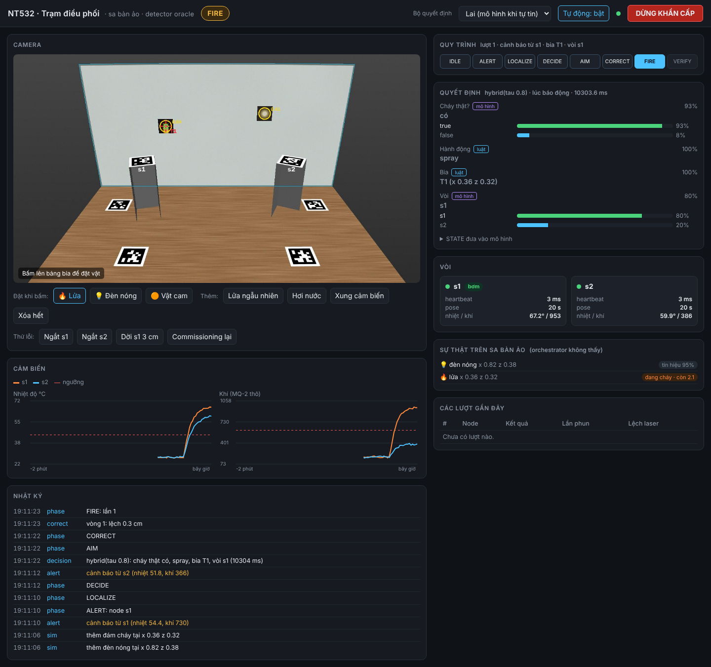

# Orchestrator, lớp nối mô hình và dashboard

Phần này nối các mảnh đã có thành một trạm chạy được: thị giác (YOLO và định vị), cảm biến (telemetry và cảnh báo qua CoAP), bộ quyết định (luật, mô hình Jev hoặc lai) và node chấp hành (pan–tilt, laser, bơm). Chạy được ngay trên sa bàn ảo; khi có phần cứng thì đổi camera và link, không đổi orchestrator.

```
uv run python scripts/run_station.py --source sim                    # mở http://localhost:8080/
uv run python scripts/run_station.py --source sim --decider hybrid   # cần runs/decider/jev/jev1 và --extra decider
uv run python scripts/run_station.py --decider rules                 # phần cứng: webcam + CoAP
```

## Luồng dữ liệu

```
 sensor H2 ──/t, /a──▶ CoapLink ─┬─▶ SensorHistory ─┐
                                  └─▶ Orchestrator ◀─┤
 webcam ──▶ FrameHub ──▶ Vision.targets ─▶ aggregate ┤
                                                     ▼
                                     fusion.decide_obs (cùng dạng bộ kịch bản)
                                                     ▼
                                     Decider: luật | Jev | lai  ──▶ Decision
                                                     ▼
                       chặn an toàn cứng (luật) ──▶ AIM ─▶ CORRECT ─▶ FIRE ─▶ VERIFY
                                                     │
                                       NodeLink: /aim /fire /stop /hb ◀─ /status
 Dashboard (HTTP) đọc Station.snapshot(), video MJPEG có vẽ, gửi lệnh
```

| Module | Việc |
| --- | --- |
| `nt532/net/protocol.py` | Payload hợp đồng CoAP mục 4 (key ngắn, dưới 60 byte), kiểm tra dạng, chống lặp `(n, s)` |
| `nt532/net/link.py` | `NodeLink`: cấp id lệnh, chờ `/status`, tuổi heartbeat; `HeartbeatSender` gửi `/hb` mỗi 500 ms |
| `nt532/net/coap.py` | `CoapLink` bằng aiocoap: server `/t`, `/a`, `/status`; client `/aim`, `/fire`, `/stop`, `/hb` |
| `nt532/orchestrator/fusion.py` | Gộp telemetry, phát hiện qua nhiều khung và sức khỏe vòi thành `obs` đúng dạng bộ kịch bản |
| `nt532/orchestrator/decide.py` | `RuleDecider`, `JevDecider`, `HybridDecider`, cùng trả `Decision` (đáp án, xác suất, nguồn) |
| `nt532/orchestrator/aiming.py` | Góc pan/tilt từ pose đế, giới hạn góc, offset tâm quay, bù tilt cho nước |
| `nt532/orchestrator/machine.py` | State machine mục 4 và các chặn an toàn |
| `nt532/orchestrator/frames.py` | Một luồng đọc camera, `fresh()` thay `read_fresh` |
| `nt532/sim/world.py` | Thế giới ảo thời gian thực: lửa, vật gây nhiễu, cảm biến, `SimLink`, `OracleDetector` |
| `nt532/station.py` | Lắp tất cả: `build_sim()`, `build_real()` |
| `nt532/dashboard/` | Dashboard web, chỉ dùng thư viện chuẩn |

## Một lượt xử lý

1. **ALERT:** node gửi `/a`; `CoapLink` chống lặp theo `(n, s)` rồi đưa vào hàng đợi. Cảnh báo xếp hàng quá 30 s thì bỏ.
2. **LOCALIZE:** lấy 4 khung (tối đa `localize_timeout_s` nếu chưa thấy gì), `vision.targets` từng khung, ghép thành từng bia theo vị trí (cách nhau dưới 5 cm là một bia), mỗi bia có conf theo từng khung (`None` khi mất).
3. **DECIDE:** dựng `obs` giống hệt bộ kịch bản: 5 mẫu cảm biến cuối của mỗi node, bia và khoảng cách tới từng node, tuổi heartbeat và pose, khả năng với tới tính từ pose đo được. Hỏi `real_fire`, `action`, `target`, `nozzle`.
   - `ignore`: về IDLE.
   - `alarm only` hoặc không chọn được bia: sang ALARM (node đã tự hú còi).
   - `spray`: qua bước chặn an toàn rồi ngắm.
4. **Chặn an toàn (luôn là luật):** chưa commissioning hoặc node bị dời, pose quá 60 s, mất heartbeat quá 1,5 s, mục tiêu ngoài bảng, góc ngoài giới hạn. Vòi được chọn bị chặn thì thử vòi còn lại, không được thì ALARM.
5. **AIM và CORRECT:** gửi `/aim`, chờ `reached` (hết giờ thì gửi lại đúng một lần với id mới). Bật laser bằng `/fire dev=laser`, so ảnh bật và tắt để tìm vết, bù độ lệch, lặp tối đa `correct_max_iters` hoặc tới khi lệch dưới `correct_done_m`.
6. **FIRE:** cộng `water_tilt_deg`, ngắm lại, `/fire dev=pump ms=fire_ms`, chờ `done`.
7. **VERIFY:** chờ 3 s, chụp 3 khung lấy conf quanh bia, lấy nhiệt sau phun của node, độ lệch laser đo được ở vòng CORRECT cuối. Hỏi `after_verify`:
   - `done`: xong.
   - `re-aim`: AIM và CORRECT lại.
   - `spray more`: phun tiếp không ngắm lại.
   - `call human`: sang HUMAN. Tối đa 3 lần phun.
8. Mọi kết thúc (kể cả lỗi) đều gửi `/stop` tới mọi node. Lỗi mạng hoặc lỗi lạ thì sang FAULT.
9. **Báo lại:** node chỉ gửi `/a` lúc chuyển sang báo động. Nếu lượt trước kết luận xong mà 3 mẫu mới nhất vẫn vượt ngưỡng sau 20 s, orchestrator tự xử lý lại. Tối đa 2 lần liên tiếp, sau đó ghi lỗi "cần người kiểm tra".

## Bộ quyết định

| `--decider` | Hành vi |
| --- | --- |
| `rules` | Baseline luật của kế hoạch (`nt532.decider.rules`), không cần torch |
| `jev` | Mô hình Jev ở `runs/decider/jev/<--jev-run>`, cần `uv sync --extra decider` |
| `hybrid` | Từng câu hỏi: đáp án mô hình nếu độ tin cậy đã hiệu chỉnh ≥ `--tau`, ngược lại luật. Mô hình lỗi thì dùng luật cả lượt và báo trên dashboard |

Có thể đổi bộ quyết định ngay trên dashboard. `Decision` ghi cả đoạn STATE đã đưa vào mô hình, nên xem được trên dashboard và trong nhật ký.

Đo ngày 08/10 trên container 4 nhân x86, CPU, fp32, với `heads_only`: nạp mất khoảng 28 s, mỗi lần `decide()` mất khoảng **8,4 s**, vì mỗi lần quyết định phải mã hóa khoảng 9 chuỗi qua backbone 271M. Pi 5 có thể chậm hơn. Trước khi dùng Jev trên Pi cần đo lại; nếu quá chậm thì cân nhắc chạy bộ quyết định trên máy khác qua mạng, lượng tử hóa hoặc ONNX, hoặc chỉ hỏi mô hình ở bước VERIFY (nơi luật yếu nhất).

## Dashboard



- **Camera:** video có vẽ viền bảng, bia (vòng vàng và conf), bia được chọn (dấu đỏ), điểm ngắm, vết laser đo được. Trên sa bàn ảo, bấm lên bảng để đặt lửa, đèn nóng hoặc vật cam.
- **Quy trình:** bước hiện tại của state machine, lượt, bia, vòi.
- **Quyết định:** từng câu hỏi, đáp án, độ tin cậy, nguồn (luật hoặc mô hình), thanh xác suất, đoạn STATE.
- **Vòi:** tuổi heartbeat và pose, lý do bị chặn; trên sa bàn ảo còn có trạng thái laser và bơm.
- **Sự thật trên sa bàn ảo:** lửa còn cháy hay đã tắt, vật gây nhiễu. Orchestrator không thấy phần này, dùng để so với quyết định.
- **Cảm biến** 2 phút gần nhất kèm ngưỡng, **nhật ký**, **các lượt gần đây**.
- **Nút:** dừng khẩn cấp, tắt chế độ tự động, commissioning lại, đổi bộ quyết định. Trên sa bàn ảo còn có hơi nước, xung cảm biến, ngắt liên lạc từng node, dời node.

API cho script khác: `GET /api/state`, `GET /api/events?since=N`, `GET /snapshot.jpg`, `GET /stream.mjpg`, `POST /api/cmd` với `{"cmd": "stop" | "enable" | "recommission" | "decider" | "fire" | "lamp" | "object" | "steam" | "spike" | "clear" | "online" | "move_node", ...}`. Không có xác thực, chỉ mở trong LAN của sa bàn.

## Sa bàn ảo

`SimWorld` chạy theo thời gian thực. Mọi số liệu dưới đây là **giả định để demo**, không phải số đo:
- **Cảm biến:** mỗi nguồn kéo nhiệt, khí, ẩm của từng node lên theo `e^(-khoảng cách/0,35 m)` với hằng số thời gian vài giây. Node lấy mẫu 1 Hz, báo động khi 3 mẫu liên tiếp vượt ngưỡng, hủy khi 5 mẫu dưới ngưỡng.
- **Lửa:** cần khoảng 0,8 đến 2,6 "giây phun trúng" (nước rơi trong 3,5 cm quanh tâm) mới tắt. Tắt rồi thì thẻ đổi sang thẻ cháy sém.
- **Servo:** mỗi node lệch ngẫu nhiên tới 3° để vòng CORRECT có việc. `/aim` mất 0,15 s cộng thời gian quay (150°/s).
- **Detector:** khi chưa có `models/fire-n.pt` và thẻ in từ D-Fire, dùng `OracleDetector`. Detector này đọc thẻ thật trong scene và cho conf theo loại: lửa 0,55 đến 0,92, đèn 0,2 đến 0,6, vật cam 0,08 đến 0,45, thẻ đã tắt gần 0. Mỗi khung có 10% bỏ sót. Có trọng số thì dùng `--detector yolo`; thẻ tổng hợp (`data/sim/cards_synth/`) chưa được YOLO học nên nên dùng thẻ D-Fire.

Trên sa bàn ảo, luật để lộ đúng hai điểm yếu đã đo ở `docs/decision-model.md`: phun vào đèn nóng nằm gần sensor báo động, và kết luận `done` khi trúng mà lửa vẫn cháy (khung "sự thật" cho thấy lửa còn cháy).

## Việc còn mở, cần chốt với Hậu và Hiếu

- **Telemetry cho mô hình:** `obs` dùng 5 mẫu cuối mỗi node (giống bộ kịch bản, 1 Hz). Kế hoạch để `/t` mỗi 5–10 s thì 5 mẫu trải 25–50 s. Đề xuất: node gửi `/t` 1 Hz khi gần ngưỡng hoặc đang báo động.
- **Heartbeat:** `hb_ms` là thời gian từ lần cuối Pi nghe thấy node (bất kỳ bản tin nào hoặc ACK của lệnh CON). `/hb` là NON nên không có trả lời; nếu `/t` thưa thì tuổi heartbeat sẽ lớn. Cần node trả lời `/hb` hoặc gửi `/t` dày hơn.
- **`/status` không có tên node:** Pi suy ra từ địa chỉ nguồn (`network.nodes`). Thêm key `n` (đã hỗ trợ, tùy chọn) thì chắc hơn.
- **Laser:** dùng `/fire` với `dev=laser` và `ms`, cùng điều kiện "aim cùng id đã reached" như bơm.
- **Vết nước:** chưa có hàm đo vết nước thật; `water_mark` trong VERIFY đang lấy độ lệch laser đo được ở vòng CORRECT cuối.
- **Giới hạn góc, offset tâm quay, bù tilt cho nước, ngưỡng cảm biến:** còn là giả định trong `config/site.yaml` (`actuator`, `sensors`).
- **Ngưỡng YOLO:** `Vision.detect` lọc ở `detect_conf` 0,35, trong khi bộ kịch bản còn giữ phát hiện yếu tới 0,15. Mô hình có thể thấy ít phát hiện yếu hơn lúc train.
